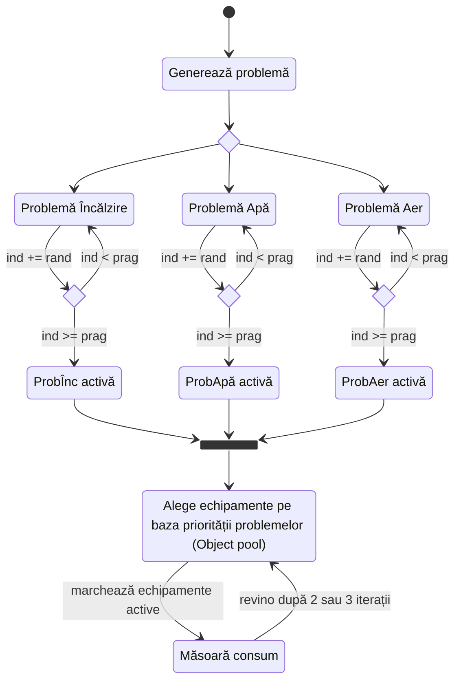

### Variantă de rezolvare colocviu ianuarie 2026

În continuare, prezentăm subiectul din ianuarie 2026 împreună cu variante posibile de rezolvare.

Reiterăm faptul că nu există o singură soluție corectă, însă varianta prezentată aici ar obține
punctaj (mult) mai mare întrucât aplică multe noțiuni distincte de POO în mod adecvat,
trecând prin toată materia.

**Nu pierdeți timp să implementați ceva ce nu se cere, deoarece nu se va puncta.**

<sub>Glumele și aluziile nu se explică. Sunt mai multe decât ar părea la prima vedere,
dar nu le-am mai inclus aici.</sub>

Să începem.

> Compania Q&V își extinde activitatea într-un nou sector economic după succesul de anul trecut.
> Pentru o lansare reușită pe piață, au nevoie de o aplicație în C++ pentru gestionarea uniformă
> și scalabilă a echipamentelor și a locurilor unde acestea sunt instalate.

Cuvintele cheie: "uniformă" și "scalabilă". Și să fie în C++, nu în Java sau alt limbaj.
Limbajul folosit la curs și la laborator.

> Fiecare echipament a fost special proiectat pentru a rezolva o problemă specifică,
> ajungând la un portofoliu de zeci de tipuri de produse.

De aici rezultă că este vorba despre familii de obiecte interconectate, pretext ideal pentru
un abstract factory.

> Echipamentele au nume, ID unic și preț. Pentru monitorizare, se calculează consumul în kWh.

Pentru ID, mai trebuie să reținem și un atribut static `id_max` ca să garantăm unicitatea.
Consumul se **calculează**, deci va fi o funcție (virtuală?), nu un atribut.

> Problemele au nume, timp de început și prioritate, cu impact măsurat la intervale de 15 minute.

Timpul de început poate fi reținut pentru simplitate printr-un număr întreg.
După cum se va specifica mai jos, este vorba doar despre o zi, deci normalizăm ca
numărul de minute de la începutul zilei. La fel ca la echipamente, și pentru impact este nevoie
tot de o **funcție**, nu atribut, deoarece este ceva dinamic care se schimbă frecvent.

> - Pentru deficiențe ale încălzirii centrale, se rețin numerele etajelor afectate

-
    - impact = $\sum_{i}^{n} etaj_i * (durata - etaj_{n-i})$

> unde n este totalul etajelor afectate; etajele au numerotarea de la 1 (prioritate medie)

Se rețin "numerele etajelor afectate", deci avem nevoie de o colecție, nu de un simplu număr.
Învățați să citiți cu atenție o cerință — multe rezolvări au folosit un simplu `int`. Numărul total
`n` nu trebuie reținut, avem funcția `.size()` pe o colecție. Trebuie folosită o instrucțiune
repetitivă, nu merge cu o formulă de felul `n * (n + 1) / 2`.

Prioritatea se trimite ca parametru la constructorul bazei, nu adăugăm setteri inutili.

> - Pentru lipsa apei calde, se rețin metrii cubi consumați
    >
- impact = std::pow(mc, durata) (prioritate scăzută)

Aici nu cred că este nevoie de vreo explicație pentru derivata în sine. Ce ar trebui să observăm:
durata apare în formulele tuturor derivatelor în calculul impactului. Asta înseamnă că în clasa de
bază putem muta logica repetitivă:

```c++
private:
    int timp_inceput;
    virtual double detalii_impact() const = 0;
    int durata(int timp_curent) const { return timp_curent - timp_inceput; }
public:
double impact(int timp_curent) const {
    return durata(timp_curent) * detalii_impact();
}
```

Alternativ, pentru timpul curent putem crea o clasă singleton separată `Clock`.

La fel ca mai devreme, prioritatea se transmite ca valoare fixată la apelul constructorilor bazei.

Mai departe:

> - Pentru calitatea aerului sub parametri, se măsoară numărul de particule (PM2.5)
    > și nivelul de dioxid de carbon (valori de la 400 în sus)
    >
- impact = durata * scor, unde scor pleacă de la 1, la care se adaugă:
  >
- +16 dacă PM  > 10 (prioritate medie)   sau +70 dacă PM  > 30 (ridicată)
>     - +10 dacă CO2 > 1000 (prioritate medie) sau +30 dacă CO2 > 2000 (ridicată)

Restricția cu "400" este un pretext pentru o excepție în constructor.

Pentru scor, ordinea în implementare va fi inversată față de cea din enunț pentru că altfel pe
ramura de "else if" nu s-ar mai ajunge vreodată. Un caz limită este când un indicator are prioritate
medie, iar celălalt ridicată: trebuie avut grijă să nu revenim la prioritate de nivel mai mic
în mod eronat. Punând cap la cap informațiile celor trei derivate, deducem că dacă indicatorii
nu depășesc inițial pragurile respective, prioritatea este scăzută.

> Echipamentele asociate sunt următoarele:
> - încălzire prin pardoseală cu piatrăroșie; consum = suprafață * preț
> - pompă de căldură geotermală; consum = 1000 / interval_metrou
> - purificator cu sare de Hihimalași; consum = 100 (în 1/7 cazuri este 0 și dă eroare)

Primele două derivate nu au nimic special, sunt doar niște simple formule. Pentru purificator,
recunosc că este ambiguitate din vina mea pentru că am vrut să fac economie de spațiu. S-au
punctat complet orice soluții care implementau măcar parțial cerința. Totuși, ar trebui
să încercăm să alegem implementarea care are cel mai mult sens.

Cele 2 cazuri:

- aparatul dă rateuri în 1/7 cazuri, deci un același aparat poate să meargă sau nu
    - formularea spune "1/7 cazuri", nu "cu probabilitate de 1/7": intenția mea era să fie folosit
      un contor ca atribut **nestatic**
- în 1/7 cazuri aparatul este complet defect și nu va funcționa vreodată, caz în care ar trebui
  să tot regenerăm aparatele până dăm de unul bun; nu știu de ce mulți au ales această variantă,
  dar da, cerința este formulată ambiguu

Acesta era alt pretext pentru a folosi excepții, de data aceasta într-o funcție care întoarce
un rezultat. Din nefericire, nu am văzut la grupele mele pe cineva care să implementeze ierarhie
de excepții **cu bază proprie**.

> Un echipament este oprit dacă o problemă nu este activă.
> O problemă devine activă dacă la momentul măsurătorii depășește un prag.
> Indicatorii cresc non-stop în mod neregulat.
> Un echipament rezolvă problema complet în 30 de minute, însă rețeaua nu permite
> funcționarea a mai mult de 2 echipamente simultan.
> Problemele trebuie rezolvate în ordinea priorității și/sau a impactului.

De aici reiese că în clasele de bază mai avem nevoie de niște atribute și funcții în plus,
ceea ce reflectă faptul că și în viața reală cerințele se schimbă pe parcurs.

Să ne facem o diagramă:



Ok, este (mult) mai complicat decât prevăzusem, iar asta este varianta simplificată.
Ups... Data viitoare să vă faceți temele la timp.

Este varianta simplificată deoarece avem garanția că o problemă va fi rezolvată complet din
momentul în care are alocat un aparat timp de 2 iterații (sau ~3 dacă e un purificator defect).
În varianta complicată, echipamentele doar reduceau din impact dacă reducerea aplicată era
mai mare decât creșterea indicatorului de la fiecare pas.

Ca să fie mai realist, ar trebui să existe un decalaj între activarea problemelor și
pornirea echipamentelor: dacă problema apare la pasul $t$, echipamentul începe să își facă efectul
doar la pasul $t+1$.

Utilizarea unui Object Pool înseamnă implicit încă o situație în care avem nevoie de excepții.
În object pool poate fi apelat un factory pentru inițializarea inițială.

Pentru generarea problemelor, folosim un fel de abstract factory
(nu e chiar abstract factory pentru că nu vrem să construim și echipamentul de la zero
de fiecare dată, iar pentru probleme nu ne mai complicăm cu încă o ierarhie de factory-uri):

```c++
class Problema;
class Echipament;

class GeneratorObiecte {
    EchipamentPool* pool;
public:
    virtual Problema* make_problema() const = 0;
    virtual Echipament* get_echipament() const = 0;
};

// definiții clasă Problemă, Echipament, EchipamentPool

template <typename TipEchipament>
class GeneratorObiecteEch : public GeneratorObiecte {
public:
    Echipament* get_echipament() const override {
        // arunca EroarePool daca nu avem obiect disponibil
        return pool->echipamentDupaTip(typeid(TipEchipament));
    }
};

class GeneratorIncalzire : public GeneratorObiecteEch<EchipamentIncalzire> {
public:
    Problema* make_problema() const override {
        std::vector<int> etaje;
        int max_etaje = std::rand() % 10 + 1;
        for (int i = 0; i < max_etaje; i++)
            etaje.push_back(std::rand()%10 + (etaje.empty() ? 1 : etaje[i - 1]) + 1);
        return new ProblemaIncalzire(this, etaje);
    }
};
```

Avem nevoie de un nivel suplimentar de moșteniri ca să evităm duplicarea de cod (clasa template)
și să putem să folosim pointeri de bază fără să trebuiască să instanțiem acea clasă template cu
un tip concret.

În clasa de bază `Problema` vom proceda astfel:

```c++
class Problema {
    const GeneratorObiecte* generator; // sau cu std::weak_ptr
public:
    Problema(const GeneratorObiecte* gen, ...) : generator(gen), ... {}
    Echipament* get_echipament() { return generator->get_echipament(); }
};

// în simulare
void simuleaza() {
    auto generatori = std::vector<std::shared_ptr<GeneratorObiecte>>(
        std::make_shared<GeneratorIncalzire>(),
        std::make_shared<GeneratorApa>(),
        std::make_shared<GeneratorAer>(),
    );
    
    // din acest punct nu ne mai referim pe nicăieri la vreo derivată concretă
    // lucrăm doar cu interfețele claselor de bază
    for (auto generator : generatori) {
        if (rand()%2 == 0) {
            probleme.push_back(generator->make_problema(generator));
        }
    }
    // ...
    // mai încolo când avem de rezolvat problemele
    for (auto problema : probleme) {
        if (problema->activa()) {
            auto echipament = problema->get_echipament();
            // folosește echipament în simulare
        }
    }
}
```

Bun, deci până aici am rezolvat majoritatea cerințelor. Ne-au mai rămas două:

- definirea pragului
- rezolvarea după prioritate

Pentru definirea pragului, poate fi folosit un atribut în clasa de bază, atribute în fiecare
derivată sau o funcție (virtuală). De asemenea, putem corela pragul cu impactul
(cred că la asta mă gândeam când am scris subiectul, dar am uitat să reformulez).

Pentru prioritate, fie sortăm (ce a făcut toată lumea care a ajuns la această cerință),
fie putem rezolva mai elegant cu o coadă cu prioritate (`std::priority_queue` cu o funcție lambda).

> Compania oferă posibilitatea ca oricare dintre echipamente să fie înlocuit din aplicație
> cu un sistem HVAC de tip DIY (do it yourself), unde detaliile sunt la latitudinea clientului.
> În acest caz, consumul este semnificativ mai ridicat decât soluțiile dedicate.

Aceasta este cerința cu derivata separată de la temă. Similar cu subiectul din ianuarie 2023,
aici aveți posibilitatea să arătați orice altceva mai știți, fără prea multe constrângeri din
partea enunțului. De la grupele mele, un singur student a profitat și a făcut o clasă template.

Eventual poate fi folosit și un dynamic cast pe partea de integrare, deși subiectul a fost gândit
să descurajeze dynamic cast-urile.

> Fiecare echipament activ are asignat un IP.

Alt pretext pentru excepții. Nu prea a implementat nimeni, așa că nu a contat prea mult în barem.

> Trebuie să existe posibilitatea de a face un backup al topologiei.

Iarăși nu a implementat nimeni corect. Ideea era să putem reveni la o stare anterioară.
Trebuia implementat cu `clone` și `copy&swap`.

Doar pentru backup este nevoie să facem operații de deep copy. Pentru toate celelalte operații,
avem posibilitatea să refolosim resursele și să folosim aceiași pointeri peste tot.

> 7. Crearea unor rapoarte și statistici ale problemelor și ale echipamentelor
> 8. Integrarea unui sistem HVAC de tip DIY și evaluarea impactului (vezi cerința 7)

Pentru cerința 7, trebuia ceva mai complicat decât o simplă numărare de obiecte. Dar chiar
și pentru o numărare de obiecte, era o ocazie bună pentru a folosi șabloane de clase.

Cerința 8 are legătură cu derivata separată de la tema 2: codul care creează rapoartele și
statisticile nu trebuie să sufere vreo modificare atunci când în clasele de topologie și de
simulare sunt adăugate noi derivate. Este un mod de a evalua respectarea "S"-ului din SOLID.
