# Configurarea proiectului

Primul pas: creare cont de GitHub (dacă nu avem deja): https://github.com/signup

Pasul următor: crearea unui repository. Recomand să utilizați
repository-ul template deoarece are configurat tot ce veți avea nevoie.

| Laborant  | Link template                                |
|-----------|----------------------------------------------|
| Dragoș B  | https://github.com/Ionnier/oop-template      |
| Tiberiu M | https://github.com/MaximTiberiu/oop-template |
| Marius MC | https://github.com/mcmarius/oop-template     |

Adaptați instrucțiunile de mai jos pentru a folosi template-ul corespunzător grupei voastre.

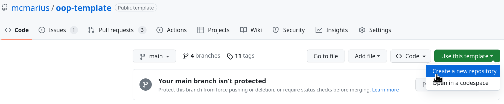

Dacă dorim să folosim biblioteci externe, ne configurăm manual proiectul cu branch-ul corespunzător (recomandat).

**Atenție! Cel mai simplu este să faceți această configurare înainte să implementați ceva.**

Alternativ, bifăm "Include all branches" (dacă există opțiunea), dar așa vom avea în mod inutil toate cele 10+ branches
în noul proiect.
Pentru detalii, [vezi mai jos](#configurare-biblioteci-externe).

Introducem un nume și eventual o descriere.

Dacă selectați vizibilitatea proiectului privată, aveți cel mult 2000 de minute pe lună pentru
partea de CI (compilat/rulat/memory leaks), deci trebuie să vă pese mai mult să nu ruleze la infinit.

<sub>O rulare (un push de commit(s)) înseamnă cel mult 8 minute: 5 workflows rulează
programul vostru, ceea ce înseamnă 40 de minute (`24*1 + 8*2 + 8*10*0`, detalii
[aici](https://docs.github.com/en/billing/managing-billing-for-github-actions/about-billing-for-github-actions#included-storage-and-minutes) -
rularea pe macOS este momentan dezactivată).
După vreo 50 de commit-uri ați consumat tot pe luna respectivă.</sub>

[//]: # (FIXME: macOS este momentan dezactivat, nu se rulează codul)

**Indiferent de vizibilitatea proiectului, trebuie să rezolvați _toate_ erorile!**

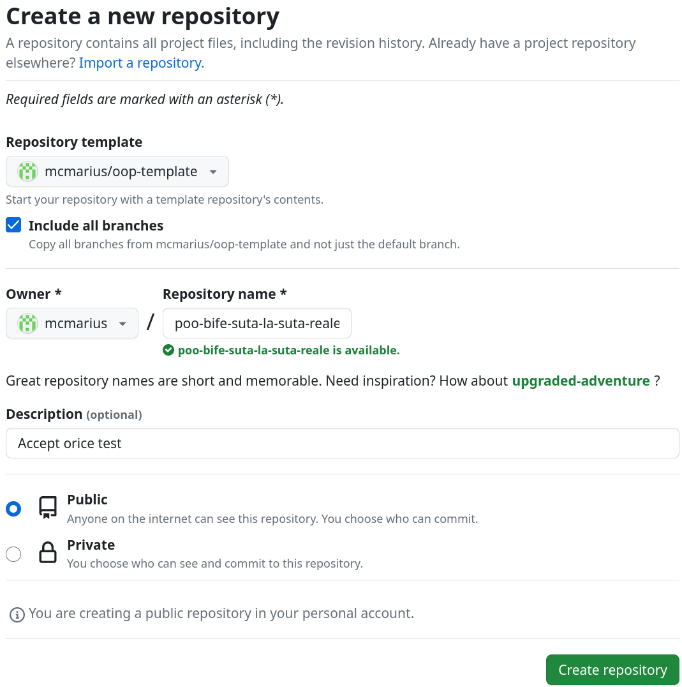

După ce apăsăm pe "Create repository", avem 2 opțiuni:

- dacă nu dorim să folosim biblioteci externe, mergem direct la [acest pas](#configurare-proiect-din-ide)
- pentru biblioteci externe, trebuie clonat proiectul local (sau "Include all branches", nerecomandat),
  iar apoi schimbat din browser branch-ul implicit.

## Configurare biblioteci externe

Trebuie să vă clonați proiectul local și să folosiți următoarele comenzi pentru a include branch-ul dorit, după care
puteți urma instrucțiunile de mai jos.

Atenție! Aveți grijă să nu suprascrieți configurația inițială. Fișiere la care să fiți atenți:

- `.github/`: configurația de CI
- `CMakeLists.txt`: configurația de CMake
- `README.md`: lista de cerințe
- `main.cpp`: exemple de cod

Pentru branch-ul common-libs:
```sh
# dacă nu aveți deja proiectul local
git clone <proiectul vostru>
cd <nume proiect>
#
# adăugăm ca sursă "remote" repository-ul template
git remote add origin2 https://github.com/mcmarius/oop-template.git
# preluăm local la noi repository-ul template
git fetch origin2
# creăm un nou branch numit common-libs din branch-ul common-libs provenit din origin2
# putem denumi și altfel branch-ul, doar că nu putem folosi un nume de branch deja existent
git checkout --orphan common-libs origin2/common-libs
# facem commit cu fișierele preluate de pe acel branch
git commit -m "Initial commit"
git push origin common-libs
# opțional, facem curat și eliminăm remote-ul pentru template
# git remote remove origin2
```

Pentru branch-ul sfml:
```sh
# dacă nu aveți deja proiectul local
git clone <proiectul vostru>
cd <nume proiect>
#
# adăugăm ca sursă "remote" repository-ul template
git remote add origin2 https://github.com/mcmarius/oop-template.git
# preluăm local la noi repository-ul template
git fetch origin2
# creăm un nou branch numit sfml din branch-ul sfml provenit din origin2
# putem denumi și altfel branch-ul, doar că nu putem folosi un nume de branch deja existent
git checkout --orphan sfml origin2/sfml
# facem commit cu fișierele preluate de pe acel branch
git commit -m "Initial commit"
git push origin sfml
# opțional, facem curat și eliminăm remote-ul pentru template
# git remote remove origin2
```

Folosim opțiunea `--orphan` pentru a nu căra tot istoricul de pe repo-ul template.

### Diferențe dintre diverse versiuni

#### Diferențe între templates

| Proiect                   | Diferențe                                                                                      |
|---------------------------|------------------------------------------------------------------------------------------------|
| Ionnier/oop-template      | [aici](https://github.com/mcmarius/oop-template/compare/main...Ionnier:oop-template:main)      |
| MaximTiberiu/oop-template | [aici](https://github.com/mcmarius/oop-template/compare/main...MaximTiberiu:oop-template:main) |
| mcmarius/oop-template     | N/A                                                                                            |

#### Diferențe între branches

În cazul exemplelor pentru biblioteci externe, probabil este mai bine să plecați de la branch-ul de bază (dacă nu este
`main`) ca să înțelegeți toți pașii.

| Branch                   | Branch de bază      | Diferențe                                                                                                                                                 |
|--------------------------|---------------------|-----------------------------------------------------------------------------------------------------------------------------------------------------------|
| main                     | N/A                 | N/A                                                                                                                                                       |
| baze-de-date/pqxx        | main                | [aici](https://github.com/mcmarius/oop-template/compare/main...baze-de-date/pqxx)                                                                         |
| baze-de-date/sqlite      | main                | [aici](https://github.com/mcmarius/oop-template/compare/main...baze-de-date/sqlite)                                                                       |
| common-libs              | main                | [aici](https://github.com/mcmarius/oop-template/compare/main...common-libs)                                                                               |
| descarcare-date-api      | main                | [aici](https://github.com/mcmarius/oop-template/compare/main...descarcare-date-api)                                                                       |
| http-server              | main                | [aici](https://github.com/mcmarius/oop-template/compare/main...http-server)                                                                               |
| sfml                     | main                | [aici](https://github.com/mcmarius/oop-template/compare/main...sfml)                                                                                      |
| sfml3.0                  | main (vezi și sfml) | [aici](https://github.com/mcmarius/oop-template/compare/main...sfml3.0) și [aici (sfml)](https://github.com/mcmarius/oop-template/compare/sfml...sfml3.0) |
| sfml-imagini-externe-api | sfml                | [aici](https://github.com/mcmarius/oop-template/compare/sfml...sfml-imagini-externe-api)                                                                  |
| sfml-resurse-locale      | sfml                | [aici](https://github.com/mcmarius/oop-template/compare/sfml...sfml-resurse-locale)                                                                       |
| sfml3.0-resurse-locale   | sfml3.0             | [aici](https://github.com/mcmarius/oop-template/compare/sfml3.0...sfml3.0-resurse-locale)                                                                 |
| tests/Boost-ext-ut       | main                | [aici](https://github.com/mcmarius/oop-template/compare/main...tests/Boost-ext-ut)                                                                        |
| tests/gtest              | main                | [aici](https://github.com/mcmarius/oop-template/compare/main...tests/gtest)                                                                               |

### Schimbarea branch-ului implicit

Ne ducem la setările proiectului ("Settings"), apoi apăsăm pe butonul de schimbat branch-ul principal
cu 2 săgeți: "Switch to another branch" din cadrul rubricii "Default branch".

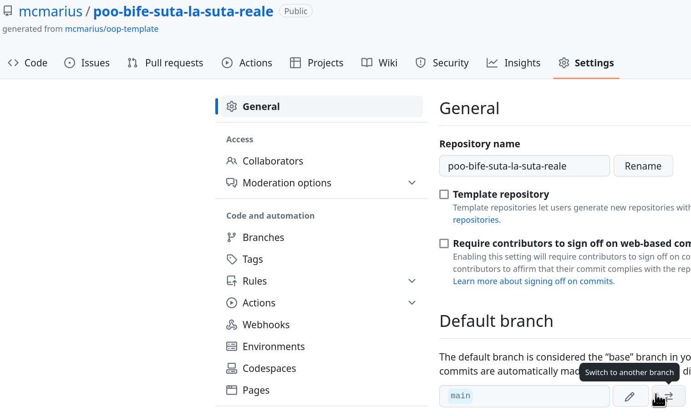

Schimbăm branch-ul și confirmăm modificarea:

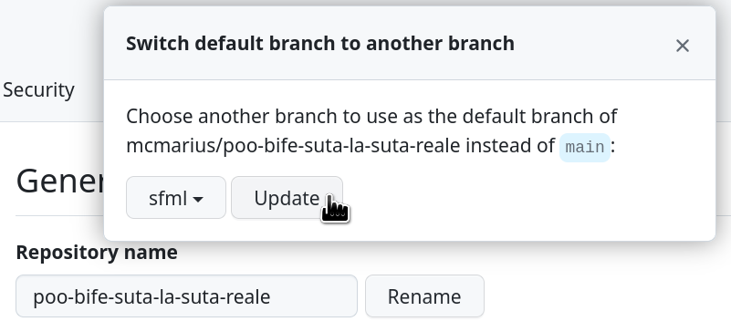

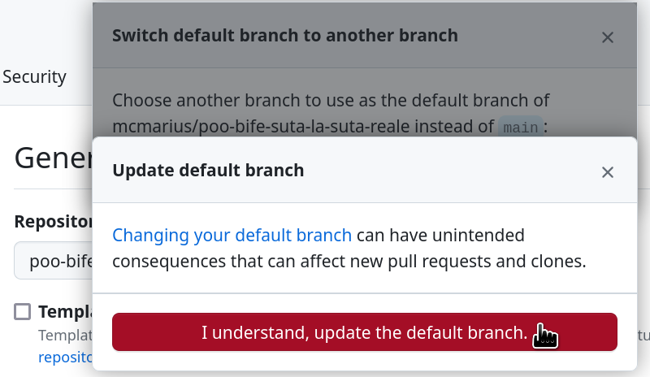

Opțional, după această modificare am mai avea 2-3 pași de făcut:

- ștergem fostul branch `main` (sau `master`) pentru a putea refolosi numele:
  facem asta din pagina principală a proiectului

  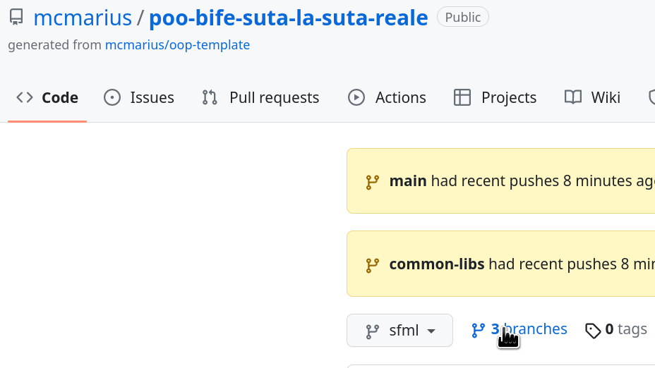
  

- redenumim noul branch principal în `main` (sau `master`):
  facem asta din setări de unde am schimbat mai devreme branch-ul principal

De abia **după** ce am terminat de redenumit branch-urile ar fi bine să ne clonăm proiectul local
(la noi pe calculator).

## Configurare proiect din IDE

Pentru configurare cu VS Code (nu recomand), vezi [aici](./vscodium.md).

Dăm click pe "Get from VCS".

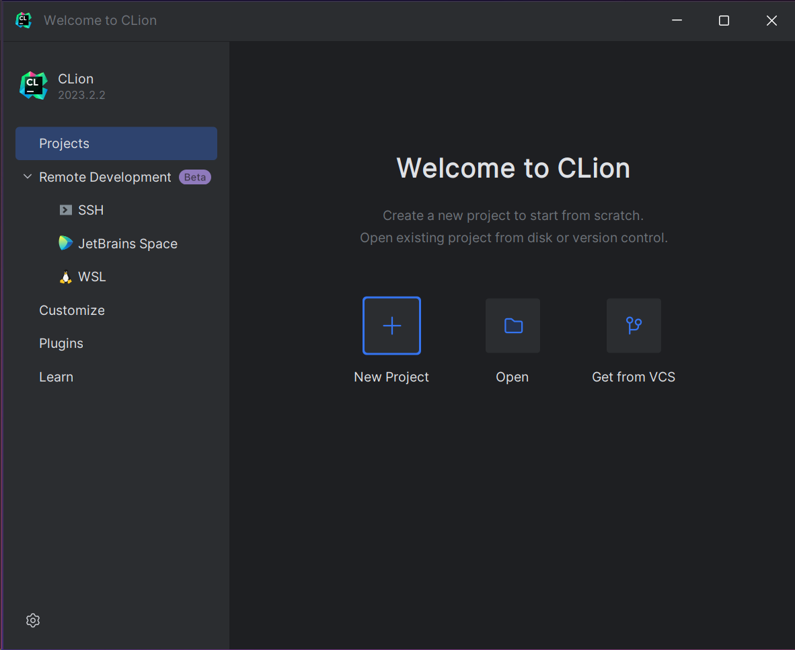

Dacă programul `git` nu este instalat (sau nu este găsit în variabila de cale `PATH`),
dăm click pe butonul "Download and install":

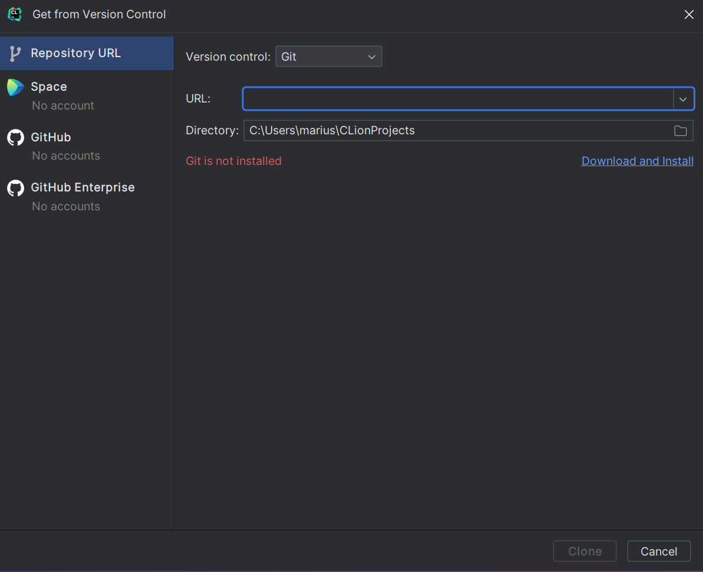

După ce s-a instalat programul `git`, ne logăm pe contul de GitHub:


După ce ne-am logat, identificăm proiectul nostru în listă și îl selectăm pentru clonare,
apoi confirmăm că proiectul este de încredere ("Trust Project"):

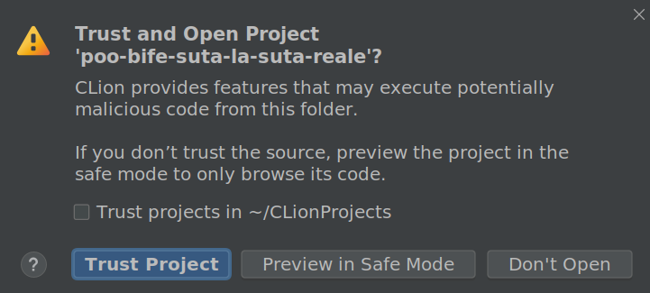

La următoarea fereastră nu avem (momentan) nimic de modificat, apăsăm "OK":

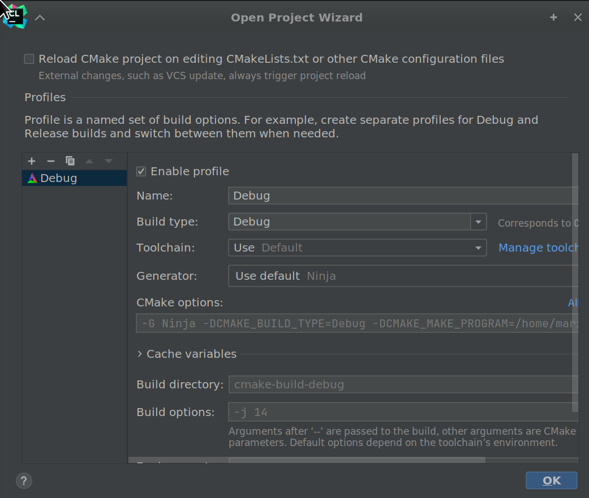

După câteva secunde (sau minute), proiectul ar trebui să fie configurat.

### Configurare working directory

Acest pas nu (mai) este neapărat necesar - funcția `copy_files` definită în repository-ul template (
`cmake/CopyHelpers.cmake`) oferă o funcționalitate aproape echivalentă - **nu uitați să o apelați**.

Dacă avem fișiere pentru date de intrare, este necesar să configurăm directorul de lucru
(working directory).

Din dreapta sus dăm pe "Edit Configurations..." (sau din meniu -> Run -> "Edit Configurations..."):

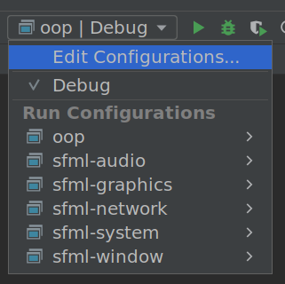

După cum vedem, la "Working directory" nu este configurat nimic.

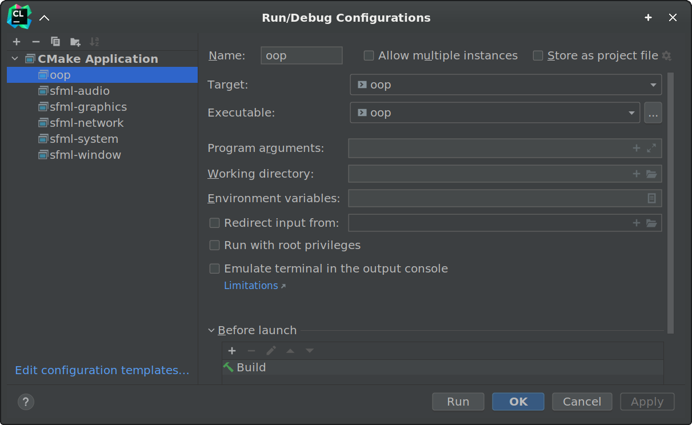

Dacă folosim biblioteca rlutil sau ceva similar pentru afișări mai speciale în terminal,
ar trebui să selectăm "Emulate terminal in the output console".

Avem 2 variante:

- variabilă de CMake
- selectare manuală

În prima variantă, dăm pe + și selectăm "ProjectFileDir":

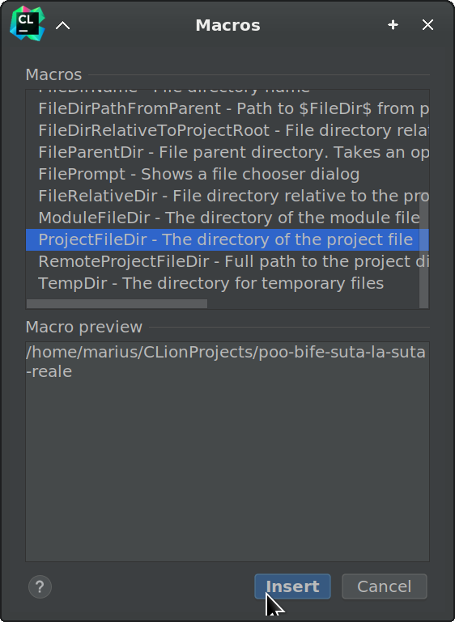

Pentru a doua variantă, dăm pe butonul de "Browse", apoi pe al treilea buton din stânga
("Project Directory"), apoi "OK":

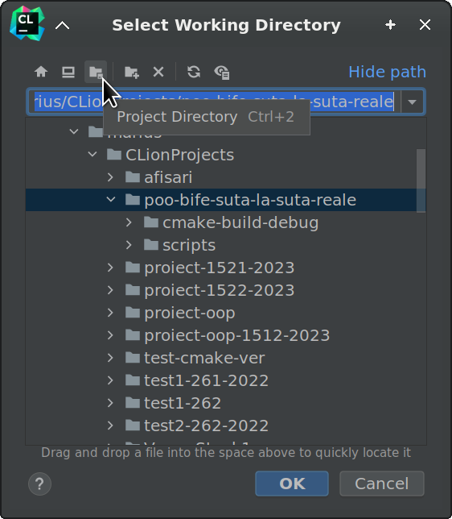

---

---

---

Pentru continuare, după ce este gata o parte din temă, vezi
[comenzile uzuale de git](./README.md#comenzi-uzuale-de-git).

# Gata! 🎉

