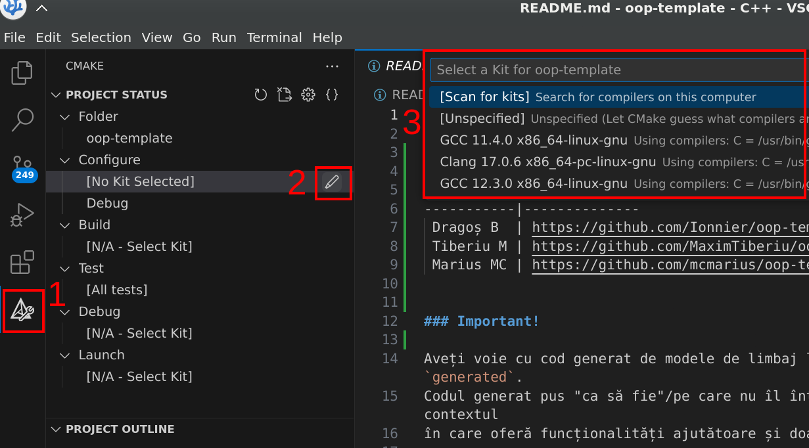
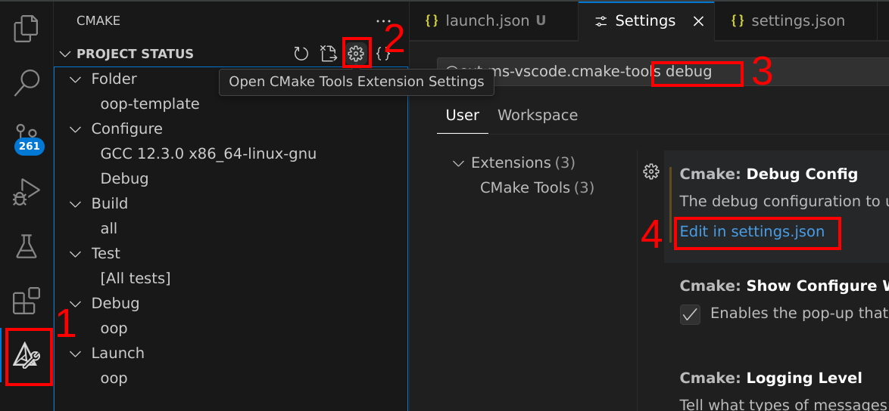
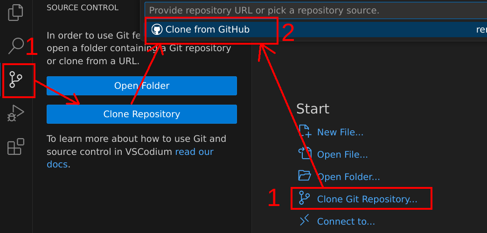
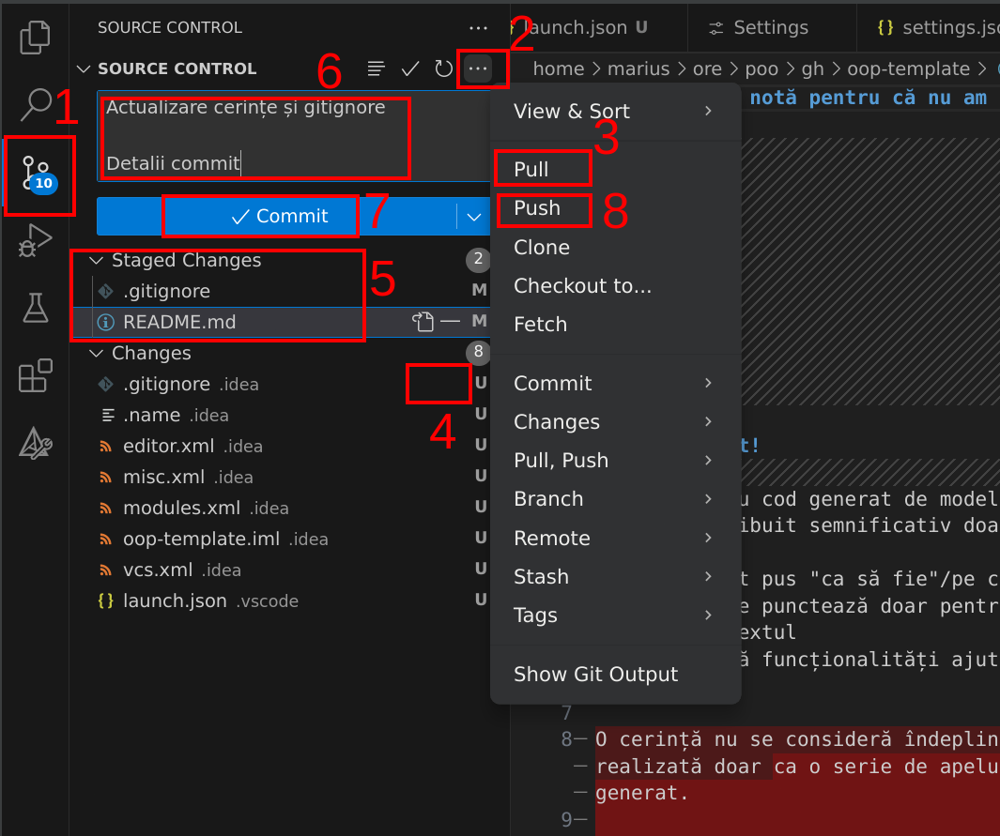

# Exemplu de configurare mediu de lucru cu VSCodium

#### Despre editoare

Editoarele pot fi încadrate în 3 categorii:

- simple editoare de text: ~~Notepad~~, Notepad++, gedit, nano etc.
- editoare cu plugin-uri: vim, emacs, VSCode, Kate etc.
- IDE-uri: CLion, Visual Studio, XCode etc.

Alegerea este în mare parte subiectivă.

Pentru mici modificări, prefer editoarele simple datorită vitezei și al consumului mic de resurse.

Pentru dezvoltare serioasă, prefer un IDE.

La mijloc sunt editoarele cu plugin-uri care necesită configurări suplimentare și sunt de obicei (mult) mai slabe decât
IDE-urile (mă refer în special la VS Code), chiar și cu plugin-uri.

Întrucât de câțiva ani VS Code este foarte popular (popular != bun), am făcut acest ghid pentru a documenta minimal
partea de setup. Personal nu sunt fan al acestui editor din nenumărate motive, dar să nu ziceți că nu există informația
undeva 🙂

Pentru modificarea mai multor fișiere din browser, mi se pare acceptabil și VS Code. Dar cam atât.
De pe pagina principală a unui repository, apăsați pe
tasta [punct](https://github.com/github/dev) ([detalii](https://docs.github.com/en/codespaces/the-githubdev-web-based-editor#opening-the-githubdev-editor)).

### Instalare

Nu sunt fan Microsoft, așa că ghidul de față folosește [VSCodium](https://vscodium.com/).

Încercați să nu vă dați datele (personale) prin tot felul de locuri și să limitați pe cât posibil aceste date atunci
când nu aveți de ales. De asemenea, încercați să nu depindeți de produse dezvoltate de o singură companie/într-un
ecosistem închis (vendor lock-in).

Pe scurt, încercați să nu fiți ignoranți. Vezi și [aici](https://en.wikipedia.org/wiki/Enshittification).

Aveți instrucțiuni de instalare [aici](https://vscodium.com/#install), iar pentru a lua direct un executabil,
vedeți [aici](https://github.com/VSCodium/vscodium/releases).

### Configurare compilator

Presupunem că aveți deja instalat un compilator care este adăugat în cale și aveți instalat (în cale) CMake și git.

Pentru CMake nu prea avem de ales, folosim extensia oficială (care implicit are
telemetrie) [CMake Tools](https://open-vsx.org/vscode/item?itemName=ms-vscode.cmake-tools).

Dați pe tab-ul de CMake, editați configurația și apoi selectați compilatorul dorit. Ar trebui să arate în felul următor:


Dacă totul merge bine, textul din tab-ul de Output din partea de jos ar trebui să se încheie cu ceva de felul următor:

```
[cmake] Compiler: GNU version 12.3.0
[cmake] -- Configuring done (0.4s)
[cmake] -- Generating done (0.0s)
[cmake] -- Build files have been written to: ...
```

Pentru depanare, ar fi extensia [Native Debug](https://open-vsx.org/vscode/item?itemName=webfreak.debug). Vedem încă un
exemplu de vendor lock-in prin care extensia oficială
de C/C++ merge intenționat doar pe VS Code (nu și VSCodium), are telemetrie și este mai dificil de configurat cu alt
compilator decât bloatware-ul de MSVC. Pentru configurația cu VS Code, instrucțiunile ar
fi [aici](https://github.com/microsoft/vscode-cmake-tools/blob/main/docs/debug-launch.md).

În `.vscode/launch.json` am următoarea configurație (sub cheia `configurations`):

```json
{
    "type": "gdb",
    "request": "launch",
    "name": "Launch Program (gdb)",
    "target": "${command:cmake.launchTargetPath}",
    "cwd": "${workspaceRoot}",
    "valuesFormatting": "parseText",
    "terminal": ""
}
```

Pentru integrare în extensia de CMake, trebuie să punem configurația de mai sus în setările extensiei de CMake:

- pe extensie dăm pe setări (pașii 1 și 2)
- în setări căutăm după `debug` (pasul 3)
- deschidem `settings.json` (pasul 4)
- punem configurația de mai sus sub cheia `cmake.debugConfig`



Opțiunea `terminal` este necesară dacă avem input de la tastatură, altfel nu pare să funcționeze corespunzător. De
asemenea, terminalul extern care se va deschide trebuie închis manual la sfârșit. Dacă aveți o configurație mai
decentă (cu VSCodium), vă rog să îmi spuneți și mie și actualizez. Totuși, nu mă aștept la ceva decent de la VS Code 🙂

### Configurare proiect

Instrucțiunile sunt cu interfața implicită. Probabil veți vrea să folosiți o extensie.

De pe pagina de Welcome dați pe "Clone Git Repository". Alternativ, din stânga dați pe icon-ul de Source Control, apoi
pe "Clone Repository". Oricare dintre opțiuni (1 din imaginea de mai jos) va deschide un pop-up pentru a selecta
repository-ul. Dați pe "Clone from GitHub" pentru a vă loga cu contul de GitHub (e mai simplu când vreți să publicați
modificările - git push).

Dacă nu vreți să legați contul de GitHub la editor, trebuie să clonați repository-ul prin SSH.



### Versionarea codului

TL;DR: pașii obligatorii pe scurt:

- Pull (opțional)
- Add
- Commit
- Push

Am separat intenționat din pași pentru a vă face să înțelegeți ce se întâmplă în spate și să nu apăsați pe butoane la
întâmplare. Probabil pașii "Commit" și "Push" îi veți "uni" într-o singură etapă, dar este bine să știți diferența.



1. Click în stânga pentru opțiunile de Source Control.
2. Interfața este "bine gândită" și unele opțiuni frecvente sunt ascunse sub "More actions". Alternativ, folosiți
   Command Pallete (<kbd>Ctrl</kbd>+<kbd>Shift</kbd>+<kbd>P</kbd>).
3. `git pull`: este necesar în caz că am făcut modificări din browser/din altă parte și nu avem modificările local; dacă
   nu facem acest pas și sunt alte modificări, vom avea conflicte și nu putem publica modificările.
4. Adăugăm ce fișiere dorim să includem în commit-ul curent. Nu adăugați orbește toate fișierele, fiți atenți la ce
   faceți commit.
5. În zona "Staged Changes" vedem la ce se va face commit. Atenție! Este posibil ca un același fișier să apară și sub "
   Staged Changes", și sub "Changes". Asta înseamnă că ați mai modificat fișierul după ce l-ați adăugat (după ce i-ați
   făcut "stage"), deci trebuie adăugat din nou dacă vreți să faceți commit și la ultimele modificări.
6. Scrieți un mesaj de commit **descriptiv**. Pe primul rând este titlul mesajului (convenția e maxim 49 de caractere).
   Dacă aveți mai multe de zis, folosiți descrierea. Descrierea se pune separată printr-un rând gol de titlu.
7. Facem un commit cu ce e în "Staged Changes". Dacă dăm pe săgeata din dreapta, putem face în același timp și "Push".
   Altfel, acest commit va fi făcut doar local.
8. Push, în cazul în care nu am făcut asta la pasul 7. Este util dacă după ce am făcut commit vrem să mai aruncăm un
   ochi și să reparăm ceva înainte să facem push și să ducem codul pe remote (e.g. GitHub).

### Alte extensii

Pentru markdown (documentație), am ales
extensia [Dendron Markdown Shortcuts](https://open-vsx.org/vscode/item?itemName=dendron.dendron-markdown-shortcuts) (
pentru VS Code vezi [aici](https://marketplace.visualstudio.com/items?itemName=mdickin.markdown-shortcuts)). Acest
editor este atât de avansat încât nu are nici shortcuts de bază 🙂

Pentru alte extensii, căutați și voi. Personal nu recomand acest editor 🙂
